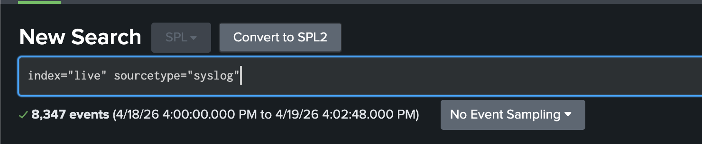
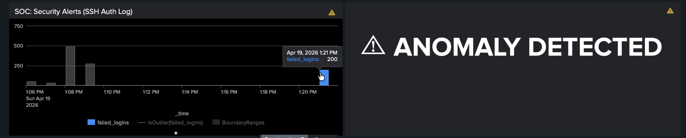
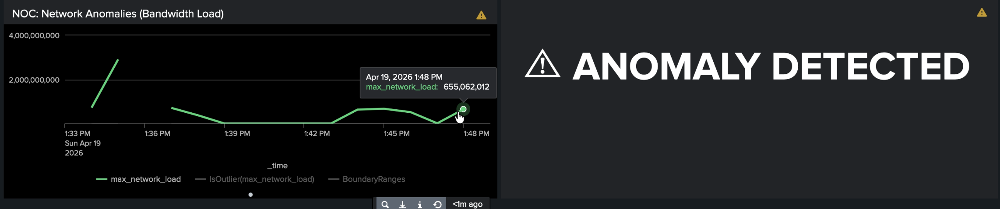

# AI-Driven Network & Security Monitoring (NOC/SOC Convergence)
## Project Overview
This is a university lab project / proof of concept that explores whether a single platform can handle both network monitoring and security monitoring at the same time. The idea is that in the real world, NOC (network ops) and SOC (security ops) teams usually work in silos with separate tools — this demo tries to bridge that gap using Splunk and its built-in machine learning capabilities.
## Lab Environment
Three virtual machines are used, spread across two hypervisors (KVM on a Fedora host and UTM on macOS):

- Splunk-Server — Ubuntu 24.04, 192.168.0.190 — this is the central SIEM running Splunk Enterprise and the MLTK. Lives on KVM.
- Target-Ubuntu — Ubuntu 24.04, 192.168.0.47 — the victim machine. Has the Universal Forwarder installed and ships its logs to Splunk. Also on KVM.
- Attacker-Kali — Kali Linux ARM64, 192.168.0.96 — the attack machine. Runs on UTM on the macOS host.
  
## Tech Stack
The core tools used in the project are Splunk Enterprise 10.2.2 (on-premise trial) for the SIEM, and the Splunk Machine Learning Toolkit (MLTK) with the DensityFunction algorithm for anomaly detection. Logs are collected via the Splunk Universal Forwarder and the Unix/Linux add-on. On the attack side, `Hydra` handles the SSH brute force and `hping3` does the volumetric flooding.

## Setup
### Infrastructure
Splunk Enterprise was installed on the server VM following the official documentation. A dedicated splunk system user was created and given ownership of /opt/splunk, and the service was configured to start on boot. Ports `8000 (web UI)` and `9997 (forwarder input)` were opened in UFW.

The `Splunk Universal Forwarder` was installed on the target VM, pointed at the Splunk server on port 9997, and configured to monitor `/var/log` which covers auth logs, syslog, and other system events.

### CICIDS2017 Dataset and Live Data

The `CICIDS2017` dataset is a publicly available collection of labeled network traffic from the Canadian Institute for Cybersecurity. It gives us realistic attack traffic to work with without having to generate everything ourselves.

Three days of data were imported: `Monday` (clean baseline traffic), `Tuesday` (contains brute force attempts) and `Wednesday` (contains DoS variants). Each CSV was loaded into Splunk via `Add Data → Upload` and put into a dedicated cicids index with sourcetype csv. The important thing is to keep the Label column intact — it tells us what each flow actually is (Benign, DoS Slowloris, SSH-Patator, etc.) which we'll use later to check how well our model is doing. This is 2 million events worth of logs.

Two data streams come from the target VM into the live index. The first is `/var/log/auth.log` forwarded via the Universal Forwarder as `sourcetype="syslog"` which captures SSH authentication events. The second is a custom `network_metrics` script that reads raw interface stats from `/proc/net/dev` every 30 seconds and forwards them as a dedicated sourcetype. To verify both are coming through, searching `index="live" sourcetype="syslog"` in Splunk should show live events.


### Attacks 
Two attacks were run from the Kali machine against the target to generate real event data. 

**SSH brute force (Hydra)**: Hammers the target with SSH login attempts using the rockyou wordlist. Each failed attempt shows up in `auth.log` as a Failed password event. With 16 parallel threads this generates enough volume per minute for the model to clearly flag as anomalous.

```bash
hydra -l root -P /usr/share/wordlists/rockyou.txt ssh://192.168.0.47 -t 16 -V
```

*Dashboard during the Hydra attack - SOC panel flags the login with bad password spike as anomalous*
**Volumetric flood (hping3)**: Blasts the target with SYN packets to spike network interface metrics. The model detects abnormal jump in rx_bytes delta between readings.

```bash
sudo hping3 -S --flood -V -p 80 192.168.0.47
```

*Dashboard during the flooding attack*

### ML Models
Both models use Splunk's `DensityFunction` algorithm. The idea is to train on a quiet baseline period so the model learns what normal looks like, then apply it to live data and flag anything that falls outside the learned distribution. No hardcoded rules.

**SOC model — SSH brute force detection**

Trained on baseline auth.log traffic, counts failed logins per minute and flags spikes.
```spl
index="live" sourcetype="syslog" host="targetserver" "Failed password"
| timechart span=1m count as failed_logins
| fit DensityFunction failed_logins into ssh_bruteforce_model
```
**NOC model — network anomaly detection**

Trained on normal interface traffic, measures the change in received bytes between each 30-second reading and flags abnormal spikes.
```spl
index="live" host="targetserver" sourcetype="network_metrics"
| rex field=_raw "enp1s0:\s+(?<rx_bytes>\d+)\s+(?<rx_packets>\d+)"
| delta rx_bytes as bytes_per_30s
| eval bytes_per_30s = abs(bytes_per_30s)
| timechart span=1m max(bytes_per_30s) as max_network_load
| fit DensityFunction max_network_load into live_network_model
```
*Validation against the CICIDS2017 dataset is in progress.*
